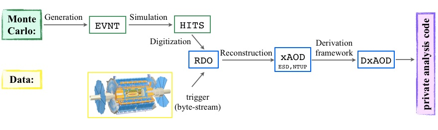
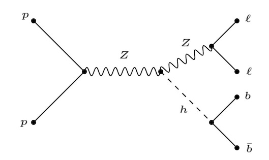

In this episodes, we hope to introduce you to a basic analysis workflow.

# ATLAS data formats

When you do an analysis, you need both recontructed data and Monte Carlo (samples). There are many steps in producing these samples and many data formats along the way. 

For MC, the events are first generated using an event generator, such as MadGraph, for example. The events are then processed through a detector simulation software and they are digitized, such that the output of this digitization ressembles events coming from the detector.

Detector specific reconstruction are run on the digitized events to reconstruct traacks and group clusters of energy. From these, objecst such as electrons, muons, and jets are built. For reconstruuction, the `Athena` frarmework that we previously introduced is used.  

At each step of the process, new data formats are created that are decreasing size and level of detail. This inforrmation is directly taken from the [ATLAS data formats twiki](https://twiki.cern.ch/twiki/bin/view/AtlasProtected/PhysicsAnalysisWorkBookRel20DataFormats):
- Byte-stream: Data which is a persistent presentation of the event data flowing from the trigger system (data only).
- EVNT: MC generator output in HepMC (MC only).
- HITS: MC energy deposition in detector from Geant4 (MC only).
- RDO (Raw Data Object) which is a C++ object representation of the byte-stream information.
- xAOD (Analysis Object Data):  a summary of the reconstructed event, and contains sufficient information for common analyses (tracks, jets, taus, etc.), accessible in using Athena or Standalone ROOT
- DxAOD: derived xAODs with refined content and event selections, specific to physics and performance groups

The DxAODs are much smaller than xAOD and they only contain variables and events of interest to a particular analysis or group of analyses. The naming convention and infomation about the various DxAODs can be found in the [Derived xAOD twiki](https://twiki.cern.ch/twiki/bin/view/AtlasProtected/PhysicsAnalysisWorkBookRel20DxAODs).

# What process have you been working on?
The MC sample is an Exotic7 DxAOD of a *ZH* sample. In this sample, the Z decays leptonically, and the Higgs boson decays to 2 b-quarks. This is illustrated in the Feynman diagram: 

# Analysis workflow 
The purpose of an analysis workflow is to define the objects and the selection to optimize for a particular signal.

Since our sample is ZH, the objects in our events are:
- 2 jets that are b-tagged 
- 2 leptons that are opposite charge since the Z boson is neutral

We also want to define event level kinematics that can help us identify our process, i.e. the invariant mass of the two jets can be used to determine if the jets came from a higgs decay.

Finally, we want to define our analysis selection. This applies all the object and event requirements on the event to help select ZH events from background. 

In today's module, we will go over these steps in more detail.



