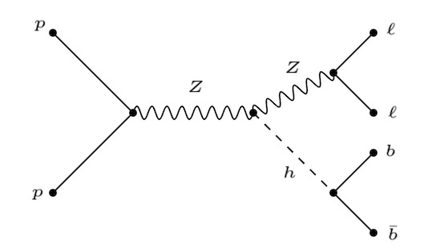
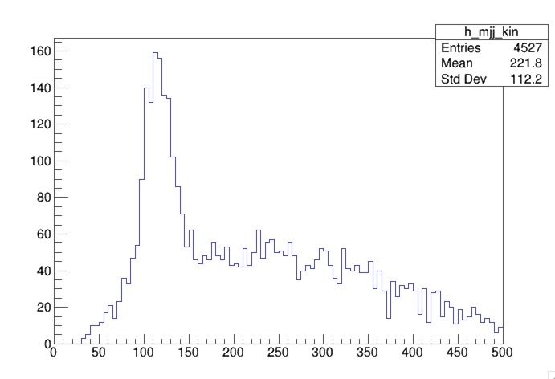
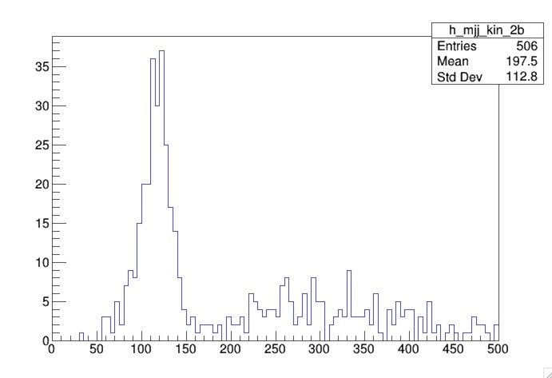

# Purpose of analysis selection

As a reminder, the sample you hhave been running is pp -> ZH -> llbb. As seen in the Feynman diagram, the Higgs boson decays to 2 b-jets, and the Z decays to 2 leptons.

Therefore, kinematics about the final state particles should help us determine their parent boson and help us discriminate this signal from any potential background. 

# Object selection 

The final state objects are the jets, electrons, and muons. We have defined them using `pt` and `eta` cuts in their respective `SelectionHelper` libraries. For b-jets, we have also if a jet is b-tagged.

# Event selection

Now that we have our objects, we now need to define our event. We apply requirements on the objects that pass the `pt` and `eta` selections to select ZH events. We can achieve this by understanding the properties of bosons and their decay products. 

## Selecting Higgs candidates

Our MC include a higgs that decays to 2 b-jets. Our analysis therefore selects at least 2 jets. To determine if the jets originate from the Higgs boson, we can calculate the invariant mass of the jets.

Let's first create a histogram to save our invariant mass histogram and one for the number of jets. We use the suffix `kin` so we know that we are using jets that pass the kinematic selection (as opposed to `raw`).
~~~code
TH1D *h_mjj_kin = new TH1D("h_mjj_kin","",100,0,500);
TH1D *h_njets_kin = new TH1D("h_njets_kin","",20,0,20);
~~~

Then we select events with at least 2 jets to fill the mjj histogram and we fill the number of calibrated jets in the njets histogram.
~~~code
if( jets_kin.size()>=2 ){
  h_mjj_kin->Fill( (jets_kin.at(0).p4()+jets_kin.at(1).p4()).M()/1000. );
}
h_njets_kin->Fill( jets_kin.size() );
~~~
{: .source}

Here, we see that we check the size of the `jets_kin` vector. This vector contains the calibrated jets that have passed the `isGoodJet` function. The function `.p4()` gives the four-momentum of the particle. 

The invariant mass of the jets is the mass of the vectorr sum of the two jets. This quantity is divided by `1000` to convert from `MeV` to `TeV`.

In order to save your histograms to the output root file, you need to write those histograms to the file.
~~~code
h_njet_kin->Write();
h_mjj_kin->Write();
~~~

Now recompile and run the analysis. This will produce an output file: `myOutputFile.root`.

> ## Question
>
> From which folder do we run the analyis?
>
> > ## Solution
> >
> > From the `run` folder.
> {: .solution}
{: .challenge}

We can look at the distributions before applying additional selections. To do this, we open our file in root.

~~~bash
root -l myOutputFile.root
~~~
{: .source}

This open a root terminal and attaches a file
~~~bash
root [0] 
Attaching file myOutputFile.root as _file0...
(TFile *) 0x29435b0
root [1] 
~~~
{: .source}

To view the contents of the file, type `.ls`.
~~~bash
root [1] .ls
TFile**        myOutputFile.root    
 TFile*        myOutputFile.root    
  KEY: TH1D    h_njets_raw;1   
  KEY: TH1D    h_njets_kin;1    
  KEY: TH1D    h_mjj_raw;1    
  KEY: TH1D    h_mjj_kin;1    
~~~
{: .source}

To visualize a histogram, you need to use the `Draw()` function with the name of the histogram you wish to draw
~~~bash
root [2] h_mjj_kin->Draw()
~~~
{: .source}

This will open a canvas wiith the invariant mass plot that you have filled when you ran the `AnalysisPayload` code.

We see a peak around 125 GeV, the mass of the Higgs boson, but we also see a long tail. 

Looking at additional distributions can help us understand what is happening. Let's draw the `h_njets_kin` histogram
~~~bash
root [2] h_njets_kin->Draw()
~~~
{: .source}

The canvas produces the number of calibrated good jets. 

The event has more than 2 jets; therefore there is ambiguity as to which jet came from the Higgs boson's decay. We can make use of the fact that the jets originating from the Higgs are b-jets by requiring that 1 or both jets are b-tagged. 

Let's create some empty histograms for the number of b-jets, mjj for at least 1 b-tagged jet, and mjj for at least 2 b-tagged jets.

~~~code
TH1D *h_nbjets_kin = new TH1D("h_nbjets_kin","",20,0,20);
TH1D *h_mjj_kin_1b = new TH1D("h_mjj_kin_1b","",100,0,500);
TH1D *h_mjj_kin_2b = new TH1D("h_mjj_kin_2b","",100,0,500);
~~~
{: .source}

We also define a counter for the number of b-tagged jets in the event, `n_bjet` after we load the event.

~~~code 
int n_bjet = 0;
~~~
{: .source}

We will increment the `n_bjet` counter if the good calibrated jet is b-tagged. To check if the jet is b-tagged, we will use the function `isJetBFlavor` from the `JetSelectionHelper` tool.

The code should look as follows

~~~code
if( jet_selector.isJetGood(calibratedjet) ){
  jets_kin.push_back(*calibratedjet);
  if ( jet_selector.isJetBFlavor(calibratedjet)){
        n_bjet ++;
  }
}
~~~
{: .source}

Now, we can fill our `mjj` histograms with the invariant mass of calibrated dijet system based on the number of b-jets, as shown in the following code.

~~~code
if( jets_kin.size()>=2 ){
  h_mjj_kin->Fill( (jets_kin.at(0).p4()+jets_kin.at(1).p4()).M()/1000. );

  h_nbjets_kin->Fill(n_bjet);
  if (n_bjet >= 1) h_mjj_kin_1b->Fill( (jets_kin.at(0).p4()+jets_kin.at(1).p4()).M()/1000. );
  if (n_bjet >= 2) h_mjj_kin_2b->Fill( (jets_kin.at(0).p4()+jets_kin.at(1).p4()).M()/1000. );
}
~~~
{: .source}

We have filled our histograms if there are at least 2 good calibrated jets. We then check the number of b-jets before filling the appropriate histograms.

The final step is writing the histograms to file.
~~~code
h_nbjets_kin->Write();
h_mjj_kin_1b->Write();
h_mjj_kin_2b->Write();
~~~
{: .source}

Now you need to recompile and run the analysis to produce a new output. You should be able to see the new histograms you have added in your output file.

~~~bash
root [1] .ls
TFile**        myOutputFile.root    
 TFile*        myOutputFile.root    
  KEY: TH1D    h_njets_raw;1    
  KEY: TH1D    h_njets_kin;1    
  KEY: TH1D    h_mjj_raw;1    
  KEY: TH1D    h_mjj_kin;1    
  KEY: TH1D    h_nbjets_kin;1    
  KEY: TH1D    h_mjj_kin_1b;1    
  KEY: TH1D    h_mjj_kin_2b;1    
~~~
{: .source}

You should draw `h_mjj_kin_2b`. You will notice that there are less events but the peak around the Higgs mass is more pronounced.

## Selecting Z candidates 

Our MC only includes leptonic decays of the Z boson, and given that the Z boson is a neutral particle and decays to 2 leptons, we should require exactly 2 leptons that are same flavor and opposite charge.

Let's first create a histogram to store our invariant mass of the two leptons.

~~~code
TH1D *h_mll_kin =  new TH1D("h_mll_kin", "", 80, 0, 200);
~~~
{: .source}

We only want to fill this histogram if we have exactly 2 electrons and their charges are opposite. The invariant mass of the two leptons is calculated the same way we did this for jets.
~~~
if ( electrons_kin.size() == 2 && electrons_kin.at(0).charge() !=  electrons_kin.at(1).charge()){
  h_mll_kin->Fill( (electrons_kin.at(0).p4()+electrons_kin.at(1).p4()).M()/1000. );
}
~~~
{: .source}

We also need to make sure we write the histogram to our output file.

~~~code
h_mll_kin->Write();
~~~
{: .source}

After you compile and run, you will see `h_mll_kin` in your output file, `myOutputFile.root`. You should draw the distribution and you will see a peak at the Z-boson mass.

> ## Adding muons
>
> Modify the if statement above to fill `h_mll_kin` if there are exactly 2 electrons or 2 muons and their charges are opposite.
>
{: .challenge}

> ## Solution
> ~~~
>if ( (electrons_kin.size() == 2 && electrons_kin.at(0).charge() !=  electrons_kin.at(1).charge()) || (muons_kin.size() == 2 && muons_kin.at(0).charge() !=  muons_kin.at(1).charge()) ){
> if (electrons_kin.size() == 2) h_mll_kin->Fill( (electrons_kin.at(0).p4()+electrons_kin.at(1).p4()).M()/1000. );
> else h_mll_kin->Fill( (muons_kin.at(0).p4()+muons_kin.at(1).p4()).M()/1000. );
>}
> ~~~
> {: .source}
>
{: .solution}



