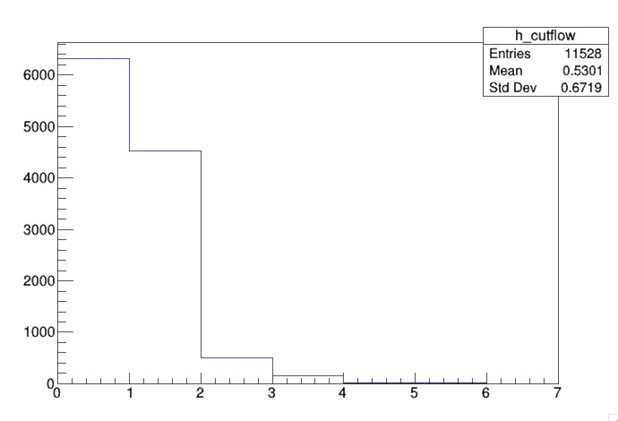

# Developing an analysis

We have learned how to select Z bosons and also Higgs bosons, now we want to develop an analysis. The way we can do this is by placing requirements on the event. You have already done when you calculated the invariant mass of the two jets, and the invariant mass of the leptons.

To calculate the invariant mass of the jets, you required at least 2 good calibrated jets. To calculate the invariant mass of the leptons, you required exactl 2 good electrons (or muons) that are opposite charge.

By applying all these selections, you are in fact writing an analysis to select ZH events.

# Writing a cutflow

A cutflow is a way to visualize the impact of the selection by sequentially applying each requirement. This allows to see the efficiency of each requirement in our event.

Based on our above selection, we will write a cutflow.

First, let's create a cutflow histogram
~~~code
TH1D *h_cutflow =  new TH1D("h_cutflow", "", 7, 0, 7);
~~~
{: .source}

Each bin in the cutflow will represent a requirement we apply. We will therefore fill each bin with events that pass a certain requirement.

Right before we close the event loop, right after the counter for the number of events, let's add our cutflow. 

We'll first start by filling the first bin in our histogram with all events so we know how many events we started with.

~~~code
h_cutflow->Fill(0);
~~~
{: .source}

Since we applied no requirements, this will count all events.

We will now apply each requirement in order and only keep events that satisfy each requirement. Let's first require at least 2 good calibrated jets. After you veto events that fail the requirement, you will fill the next bin in the cutflow histogram.

~~~code
if ( !(jets_kin_cal.size()>=2) ) continue;
h_cutflow->Fill(1);
~~~
{: .source}

Now, the remaining requirements are as follows: 
- at least 2 b-tagged jets  
- exactly 2 electrons 
- \|mjj - 125\| < 25  because the invariant mass of the dijet system should be close to the Higgs mass
- \|mll - 90\| < 10 because of the invariant mass of the two leptons should be close to the Z mass

> ## Solution
>
> Your remaining cutflow should look like this.
>
> ~~~code
> if ( !(n_bjet >= 2) ) continue;
> h_cutflow->Fill(2);
>
> if ( !(electrons_kin.size() == 2 && electrons_kin.at(0).charge() !=  electrons_kin.at(1).charge()) ) continue;
> h_cutflow->Fill(3);
> 
> if ( !(abs((jets_kin_cal.at(0).p4()+jets_kin_cal.at(1).p4()).M()/1000. - 125.) < 25) ) continue;
> h_cutflow->Fill(4);
> 
> if ( !(abs((electrons_kin.at(0).p4()+electrons_kin.at(1).p4()).M()/1000. - 90.) < 10) )continue;
> h_cutflow->Fill(5);
> ~~~
> {: .source}
>
{: .solution}

Write your histogram to the file then you can compile and run the code.

Most of the inefficiency comes from requiring 2 b-tagged jets. 

> ## Other selections
>
> Modify the number of b-jets and see the impact on the cutflow. You can also feel free to different diffferent requirements.
>
{: .challenge}

This completes today's module. For the full code from this module, please refer to the [ATLAS Example Workflow](https://gitlab.cern.ch/usatlas-computing-bootcamp-2021/v8-example-workflow) repository.



